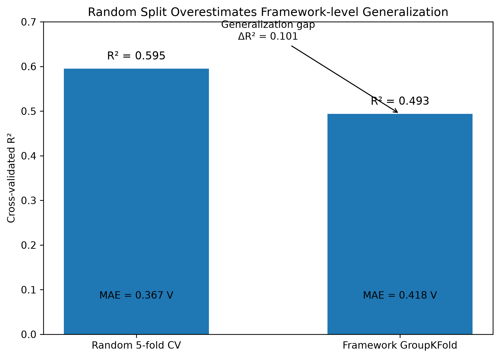
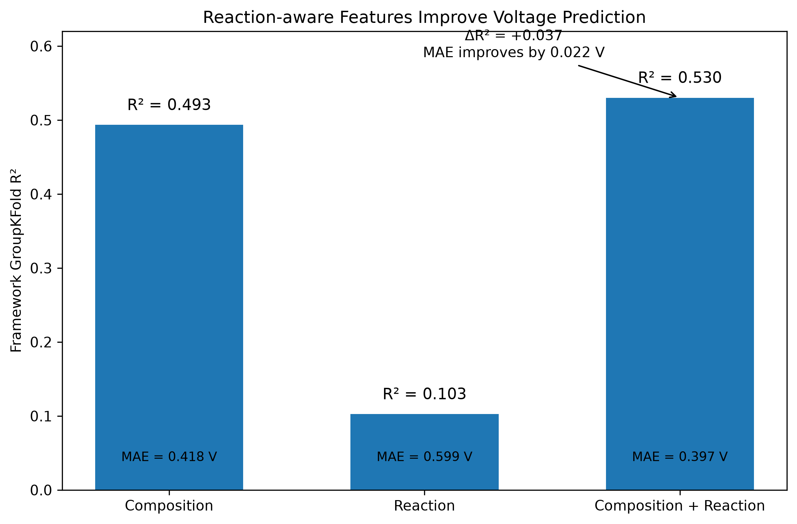
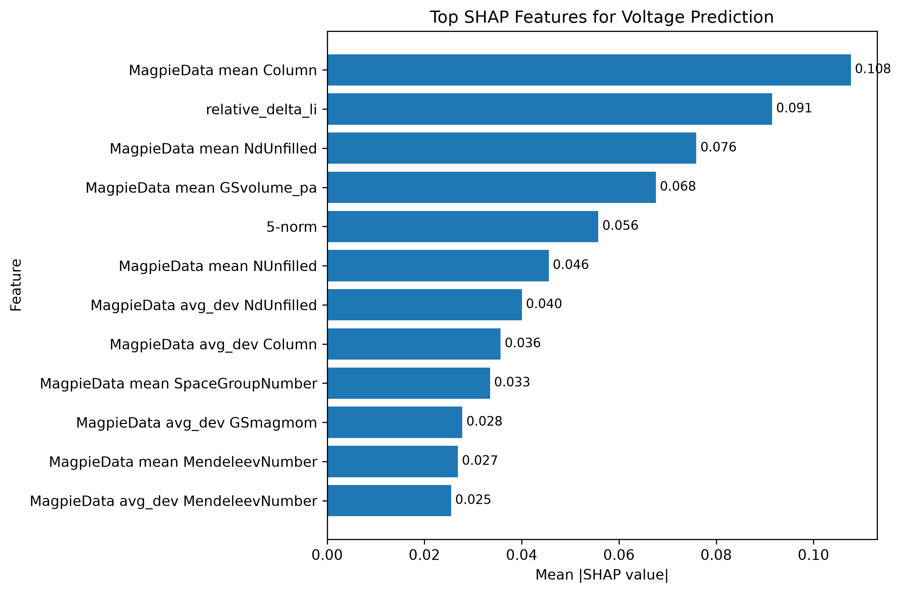
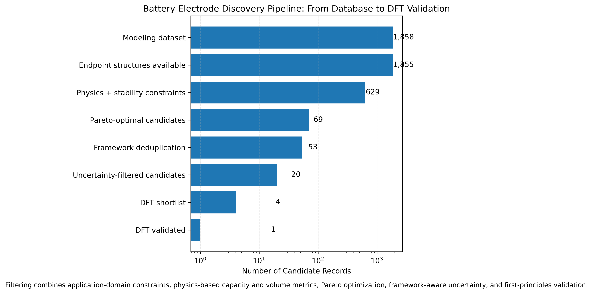
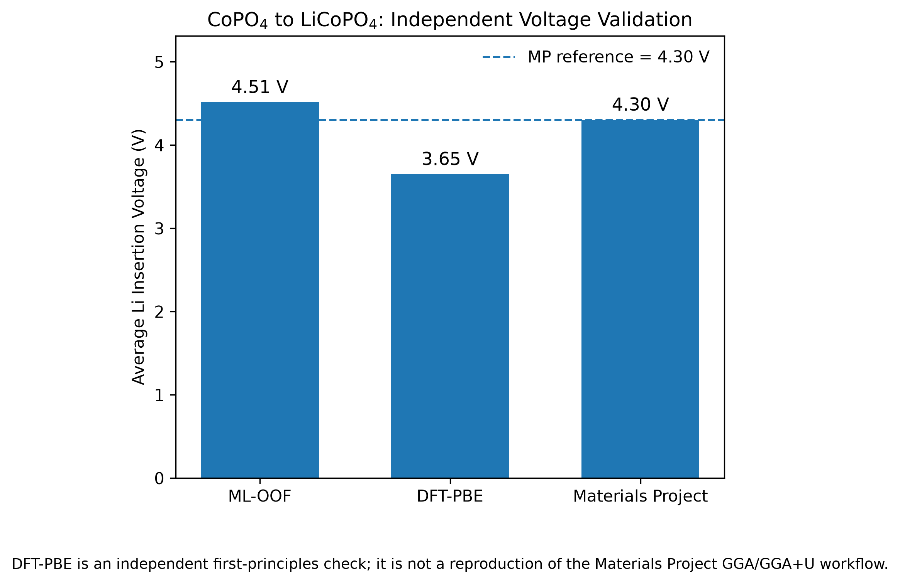

# Battery Materials Discovery for Li-ion Cathodes

> 基于 **Materials Project** 数据构建的锂离子电池正极材料筛选项目。  
> 核心路线：**Data → Leakage-aware ML → Physics → Pareto → Uncertainty → DFT**

## 1. 项目目标

本项目不是单纯做一个“材料性能预测模型”，而是尝试解决一个更接近真实材料研发的问题：

> **如何从上千个 Li insertion electrode 候选中，综合考虑 Voltage、Capacity、Volume Change 和 Stability，逐步缩小候选空间，并选出值得进一步计算或实验验证的材料？**

项目最终从 **1858 条建模数据**出发，经 **Framework-aware validation、Reaction-aware feature engineering、Physics-based property analysis、Pareto Optimization、Uncertainty filtering**，得到 **4 个 DFT shortlist**，并对排名最高的 **CoPO₄ → LiCoPO₄** 完成 **Quantum ESPRESSO** 独立 DFT 验证。

---

## 2. 项目亮点

- 使用 **Framework GroupKFold** 代替普通 Random Split，避免同类 framework 带来的 validation leakage
- 在 composition descriptors 之外引入 **Reaction Features**
- 不强行对所有 target 使用 Machine Learning，而是根据 property physics 选择方法
- 将 **Pareto Optimization + empirical uncertainty + framework deduplication** 用于候选筛选
- 从数据库级筛选推进到 **candidate-level DFT validation**
- 对 GNN、ML、Physics、DFT 的适用边界进行方法学比较，而不是简单堆模型

---

## 3. Overall Workflow

```text
Materials Project
        ↓
Data Cleaning & Domain Definition
        ↓
Composition Descriptors
        ↓
Random CV vs Framework GroupKFold
        ↓
Reaction-aware Feature Engineering
        ↓
Voltage Modeling + SHAP
        ↓
Capacity Physics
        ↓
Endpoint Volume Physics
        ↓
Engineering Constraints
        ↓
Pareto Optimization
        ↓
Framework Deduplication
        ↓
Local Empirical Uncertainty
        ↓
DFT Shortlist
        ↓
Quantum ESPRESSO Validation
```

核心原则：

> **Model complexity should follow the physics of the target property.**

---

## 4. Dataset

数据来源：**Materials Project Li insertion electrode dataset**

初始下载：

```text
2774 battery records
```

主要字段包括：

- `average_voltage`
- `capacity_grav`
- `max_delta_volume`
- `max_stability`
- `formula_charge`
- `formula_discharge`
- `framework_formula`
- `id_charge`
- `id_discharge`

经过异常值过滤、材料体系限制和 Stability 筛选后，最终建模数据为：

```text
1858 modeling records
1019 unique frameworks
```

主要研究体系：

```text
Transition metals:
Ti / V / Cr / Mn / Fe / Co / Ni

Anions:
O / P / F / S
```

---

## 5. Validation Strategy：为什么不能只用 Random Split

材料数据库中常存在相同或高度相似的 structural framework。

如果直接 Random Split，相似材料可能同时进入 Train 和 Test，从而高估模型对 unseen materials 的泛化能力。

因此比较：

- **Random 5-fold CV**
- **Framework GroupKFold**



结果：

| Validation | Mean R² | MAE |
|---|---:|---:|
| Random 5-fold CV | 0.5949 | 0.3667 V |
| Framework GroupKFold | 0.4935 | 0.4185 V |

Generalization gap：

```text
ΔR² ≈ 0.1014
```

因此后续正式 Voltage benchmark 均采用：

**Framework GroupKFold**

### 结论

> 对材料体系做 generalization evaluation 时，**数据划分方式可能比更换一个更复杂的模型更重要**。

---

## 6. Voltage Prediction

### 6.1 Composition Baseline

使用 `matminer` 生成约 **142 个 composition descriptors**，并使用 **XGBoost Regressor** 建立 Voltage baseline。

Framework GroupKFold：

```text
R²   = 0.4935
MAE  = 0.4185 V
RMSE = 0.5582 V
```

Composition 可以解释部分 Voltage 差异，但 Average Voltage 本质上属于 reaction-dependent property，仅使用静态 composition 信息仍不充分。

---

### 6.2 Reaction-aware Feature Engineering

进一步解析 charge / discharge composition，并构造：

```text
normalized_delta_li
relative_delta_li
num_steps
```

其中：

```text
corr(relative_delta_li, capacity_grav) ≈ 0.937
```

说明 Li 嵌入 / 脱出的化学计量变化包含显著 electrochemical information。

---

### 6.3 Feature Ablation

使用相同 Framework GroupKFold 比较三组 feature set：



| Feature Set | Mean R² | MAE |
|---|---:|---:|
| Composition only | 0.4935 | 0.4185 V |
| Reaction only | 0.1026 | 0.5990 V |
| Composition + Reaction | **0.5302** | **0.3966 V** |

加入 Reaction Features 后：

```text
ΔR² = +0.0367
MAE = 0.4185 → 0.3966 V
```

### 结论

> Reaction Features 不能单独替代 composition，但能够补充静态 composition descriptors 中缺失的反应信息。

---

## 7. Model Interpretation with SHAP

最终 Voltage model 使用：

**XGBoost + SHAP**



Top features 包括：

- `MagpieData mean Column`
- `relative_delta_li`
- `MagpieData mean NdUnfilled`
- `MagpieData mean GSvolume_pa`
- `5-norm`

其中：

```text
relative_delta_li
```

在 mean absolute SHAP 中排名 **#2**。

这与 Feature Ablation 结果一致：

> Voltage prediction 不仅受到元素组成影响，也受到 charge/discharge reaction extent 的显著影响。

说明：**SHAP 是 model attribution，不等同于 causal relationship。**

---

## 8. GNN Exploration：为什么没有把 GNN 作为最终 Voltage Model

项目中也构建了基于 crystal graph 的 Graph Neural Network。

Graph representation 包括：

```text
Atomic features
Atomic number
Crystal connectivity
Interatomic distance
RBF distance encoding
```

在严格 framework-separated 的单个 outer fold exploratory test 中：

```text
Distance-aware GNN
R²  ≈ 0.37
MAE ≈ 0.45 V
```

表现低于 Composition + Reaction XGBoost。

这并不说明 GNN 本身无效，而是说明：

> **Average Voltage 是 charge → discharge reaction property，仅输入单一 host crystal structure 无法完整描述整个电化学反应。**

因此项目没有继续盲目增加 GNN depth，而是回到 reaction representation 和 property physics。

---

## 9. Capacity：从 ML 回到 Physics

最初使用 Composition descriptors 预测 Capacity：

```text
GroupKFold R² ≈ 0.18
MAE ≈ 41 mAh/g
```

进一步分析发现：

```text
corr(relative_delta_li, capacity_grav) ≈ 0.937
```

于是回到 Capacity 的物理定义：

```text
Q = nF / (3.6M)
```

其中：

```text
n = transferred Li / electrons
F = Faraday constant
M = discharged electrode molar mass
```

使用正确的 discharged-state molar mass 后：

```text
R²   = 1.000
MAE  ≈ 0
RMSE ≈ 0
```

### 结论

> 如果 property 可以通过明确物理关系直接计算，就没有必要为了使用 ML 而强行建模。

因此 Capacity 最终采用：

**Physics Equation**

而不是 Machine Learning。

---

## 10. Volume Change：Structure Matters

Composition-based ML 对 `max_delta_volume` 的预测能力较弱：

```text
R² ≈ 0.12
```

因此进一步下载：

- Charge endpoint structures
- Discharge endpoint structures

得到：

```text
1855 complete structure pairs
```

基于 endpoint crystal volume 计算：

```text
|ΔV| / V
```

与 Materials Project `max_delta_volume` 对比：

```text
R²   ≈ 0.566
MAE  ≈ 0.0098
Corr ≈ 0.820
```

Residual coverage：

```text
≤ 0.001 : ~73%
≤ 0.005 : ~81%
≤ 0.010 : ~84%
```

较大残差主要集中在：

```text
multi-step reactions
F-rich systems
V-rich systems
```

因此 Volume Change 最终采用：

**Endpoint Structure Physics + Residual Analysis**

而不是继续堆叠 composition model 或 Pair-GNN。

---

## 11. Property-specific Final Strategy

最终对不同 target 采用不同策略：

| Property | Final Strategy | Reason |
|---|---|---|
| Voltage | XGBoost + Reaction Features | Reaction-dependent property |
| Capacity | Physics Equation | Determined by stoichiometry |
| Volume Change | Endpoint Structure Physics | Strong structure dependence |
| Stability | Screening Constraint | Used for candidate filtering |

因此最终路线不是：

```text
One Model → Predict Everything
```

而是：

```text
ML where ML is useful
Physics where physics is sufficient
DFT where higher-fidelity validation is needed
```

---

## 12. Multi-objective Candidate Screening

Candidate Screening 同时考虑：

```text
Voltage ↑
Capacity ↑
Volume Change ↓
Stability ↓
```

主要 application constraints：

```text
3.0 V ≤ predicted voltage ≤ 5.0 V
capacity ≥ 100 mAh/g
endpoint ΔV/V ≤ 0.10
max_stability ≤ 0.10 eV/atom
single-step reaction
```

Voltage 使用：

**Framework GroupKFold Out-of-Fold prediction**

避免使用 full-data model 对已见样本直接“自我评分”。

随后执行 Pareto Optimization。



筛选过程：

```text
1858  Modeling records
 ↓
1855  Endpoint structures available
 ↓
629   Physics + stability constraints
 ↓
69    Pareto-optimal candidates
 ↓
53    Unique frameworks
 ↓
20    Uncertainty-filtered candidates
 ↓
4     DFT shortlist
 ↓
1     Full DFT validation
```

---

## 13. Uncertainty-aware Screening

为了降低高分候选因 extrapolation 带来的风险，引入：

**Local Empirical Uncertainty**

方法：

1. 在 standardized feature space 中寻找 `k = 20` 个邻近样本
2. 排除相同 framework
3. 使用邻居的 OOF absolute residual
4. 计算 local 90th percentile error：

```text
local_q90
```

并构造 conservative voltage estimate：

```text
Voltage_LCB
=
Voltage_OOF
-
local_q90
```

这里的 uncertainty 是：

**framework-excluded OOF residual based empirical uncertainty**

不是 Bayesian uncertainty，也不是 conformal prediction。

---

## 14. DFT Shortlist

经过 Pareto、Framework Deduplication 和 Uncertainty Filtering 后，最终 shortlist：

| Rank | Candidate |
|---:|---|
| 1 | CoPO₄ |
| 2 | Ni₂(SO₄)₃ |
| 3 | MnCr₃(PO₄)₆ |
| 4 | V₂O₅ |

其中排名第一的 CoPO₄：

```text
ML OOF Voltage   ≈ 4.514 V
Local q90        ≈ 0.554 V
Voltage LCB      ≈ 3.960 V
Capacity         ≈ 166.6 mAh/g
Endpoint ΔV/V    ≈ 0.00037
```

最终选择：

```text
CoPO4 → LiCoPO4
```

进行完整 first-principles validation。

---

## 15. Quantum ESPRESSO DFT Validation

使用：

**Quantum ESPRESSO 7.5**

主要计算设置：

```text
Exchange-correlation: PBE
Pseudopotentials: SSSP Efficiency
ecutwfc = 70 Ry
ecutrho = 540 Ry
Spin-polarized
vc-relax + final SCF
```

### 15.1 Cutoff Convergence

CoPO₄ 测试：

```text
45 / 50 / 55 / 60 / 65 / 70 / 75 Ry
```

其中：

```text
70 → 75 Ry
ΔE ≈ 1.98 meV/atom
```

最终采用：

```text
ecutwfc = 70 Ry
ecutrho = 540 Ry
```

---

### 15.2 CoPO₄ k-point Convergence

测试：

```text
2×2×2
3×3×3
4×4×4
```

其中：

```text
3×3×3 → 4×4×4
ΔE ≈ 0.044 meV/atom
```

最终 CoPO₄ / LiCoPO₄ 使用：

```text
3 × 3 × 3
```

---

### 15.3 Li Metal Reference

Li metal 是 metallic reference，因此单独测试：

```text
8×8×8
10×10×10
12×12×12
14×14×14
```

Energy：

```text
8×8×8    -14.47123154 Ry
10×10×10 -14.47150752 Ry
12×12×12 -14.47175658 Ry
14×14×14 -14.47195990 Ry
```

其中：

```text
12×12×12 → 14×14×14
ΔE ≈ 2.77 meV/atom
```

最终使用：

```text
14 × 14 × 14
```

---

## 16. Structure Relaxation and Final Energies

### CoPO₄

`vc-relax`：

```text
bfgs converged in 25 scf cycles and 24 bfgs steps
Final enthalpy = -1856.4495854927 Ry
```

final SCF：

```text
E(CoPO4 cell)
= -1856.45435286 Ry
```

### LiCoPO₄

`vc-relax`：

```text
bfgs converged in 9 scf cycles and 8 bfgs steps
Final enthalpy = -1915.4152740409 Ry
```

final SCF：

```text
E(LiCoPO4 cell)
= -1915.41470790 Ry
```

### Li Metal

优化后 bcc Li：

```text
Volume ≈ 20.303 ų / atom
a ≈ 3.437 Å
```

reference energy：

```text
E(Li)
= -14.47195990 Ry / atom
```

---

## 17. DFT Voltage

研究反应：

```text
CoPO4 + Li → LiCoPO4
```

实际 QE cell：

```text
Co4P4O16 + 4Li → Li4Co4P4O16
```

正式总能：

```text
E(CoPO4 cell)
= -1856.45435286 Ry

E(LiCoPO4 cell)
= -1915.41470790 Ry

E(Li metal)
= -14.47195990 Ry / atom
```

得到：

```text
DFT-PBE Voltage
= 3.6481 V
```

对比：



| Method | Voltage |
|---|---:|
| ML OOF | **4.5139 V** |
| Materials Project | **4.3018 V** |
| QE-PBE DFT | **3.6481 V** |

误差：

```text
ML vs MP error  = +0.2120 V
PBE vs MP error = -0.6538 V
```

---

## 18. 如何理解 DFT 与 Materials Project 的差异

不能简单得出：

> “ML 比 DFT 更准确。”

因为三者并不是完全相同的 methodology。

本项目独立 DFT 使用：

```text
Quantum ESPRESSO + PBE
```

而 Materials Project 对 transition-metal systems 使用具有 database consistency 的 **GGA / GGA+U + correction workflow**。

CoPO₄ / LiCoPO₄ 涉及 Co 3d redox，plain PBE 对 localized d-electrons 和 redox energetics 存在已知局限。

因此：

```text
3.6481 V
```

更准确的定位是：

**Independent first-principles sanity check**

而不是：

**Exact reproduction of Materials Project**

本项目没有为了让结果“更接近 4.30 V”而人为调整 Hubbard U。

更严格的后续工作可包括：

```text
DFT+U sensitivity analysis
magnetic configuration comparison
consistent Hubbard projection scheme
multi-candidate DFT validation
```

---

## 19. Core Results Summary

| Module | Method | Main Result |
|---|---|---|
| Validation | Random CV | R² = 0.5949 |
| Validation | Framework GroupKFold | R² = 0.4935 |
| Voltage | XGBoost + Composition | R² = 0.4935 |
| Voltage | XGBoost + Composition + Reaction | **R² = 0.5302** |
| Interpretation | SHAP | `relative_delta_li` ranks #2 |
| Capacity | Physics Equation | **R² = 1.000** |
| Volume Change | Endpoint Structure Physics | R² ≈ 0.566 |
| Candidate Screening | Pareto + Uncertainty | 1858 → 4 shortlist |
| DFT Validation | Quantum ESPRESSO | CoPO₄ → LiCoPO₄ completed |

---

## 20. Selected Figures

### Validation Strategy


### Voltage Feature Ablation


### SHAP Interpretation


### Candidate Screening


### DFT Validation


---

## 21. Tech Stack

```text
Python
Pandas
NumPy
Scikit-learn
XGBoost
Matminer
Pymatgen
SHAP
PyTorch
PyTorch Geometric
Matplotlib
Materials Project API
Quantum ESPRESSO
SSSP pseudopotentials
```

---

## 22. Repository Structure

```text
battery/
│
├── data/
│   ├── raw/
│   └── processed/
│
├── src/
│   ├── data acquisition
│   ├── data cleaning
│   ├── feature engineering
│   ├── XGBoost modeling
│   ├── GroupKFold validation
│   ├── SHAP analysis
│   ├── GNN experiments
│   ├── capacity physics
│   ├── volume physics
│   ├── Pareto screening
│   ├── uncertainty analysis
│   └── DFT validation
│
├── models/
│
├── results/
│   ├── figures/
│   └── metrics/
│
├── dft/
│   ├── co_po4/
│   ├── li_copo4/
│   └── li_metal/
│
└── README.md
```

---

## 23. Limitations

当前项目仍存在以下限制：

- Dataset size 约 1.8k，framework-level generalization 仍有限
- Voltage GroupKFold R² 约 0.53，仍有提升空间
- GNN 只验证了 single-structure representation
- Volume Change 对 multi-step reactions 的描述仍不完整
- Uncertainty 是 empirical local residual estimation，不是严格 probabilistic uncertainty
- DFT 当前只完整验证 1 个 candidate
- DFT 使用 PBE，没有系统开展 DFT+U / magnetic ordering study

---

## 24. Future Work

后续方向：

```text
DFT+U sensitivity analysis
Magnetic configuration study
Reaction graph / pair-structure GNN
Calibrated uncertainty
Multi-candidate DFT validation
Experimental candidate verification
Active learning
```

---

## 25. 项目结论

本项目最终形成了一条完整的 Li-ion cathode screening workflow：

```text
Materials Project
        ↓
Domain-aware Dataset
        ↓
Framework-aware ML
        ↓
Reaction Feature Engineering
        ↓
Physics-based Property Analysis
        ↓
Pareto Optimization
        ↓
Uncertainty-aware Screening
        ↓
DFT Validation
```

项目最重要的结论不是“哪个模型最好”，而是：

> **材料性能预测应该根据具体 property 的物理来源选择合适的方法，而不是为了使用 Machine Learning 而强行建立模型。**

最终实现了：

**Database-level screening → Candidate-level first-principles validation**

的完整闭环。
